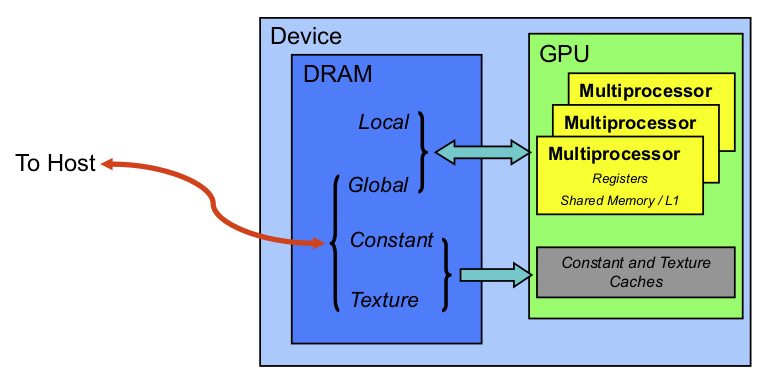

# Notes on _CUDA Fortran for scientists and engineers_

> Ruetsch, G., & Fatica, M. (2013). CUDA Fortran for scientists and engineers: best practices for efficient CUDA Fortran programming. Elsevier.

## Chapter 1. Introduction

Principle reason for the ubiquitous presence of **multiple cores** CPUs - **inability** of CPU manufacturers to increase performance in single-core designs by **boosting the clock speed**.

- GPU - fine-grained model (data parallelism)
- MPI - coarse-grained model

### Synchronization

- Data transfer via **assignment statements** are blocking or synchronous transfers! (implicit synchronization)
- **Kernel launches** are **nonblocking or asynchronous**!

### Grouping of threads

- hardware: thread processors - grouped into **multiprocessors** (caontain a `shared memory')
- software: threads - grouped into **thread blocks** - kernel launches a **grid** of thread blocks
- `threadIdx` - the index of a thread within its thread block
- `blockDim` - the number of threads in a block
- `blockIdx` - the index of the block within the grid

### Hardware features

**Compute Capability**: https://docs.nvidia.com/cuda/cuda-c-programming-guide/index.html#compute-capabilities

### Error handling

- synchronous error:
  ```
  ierrSync = cudaGetLastError()
  ```
- asynchronous error:
  ```
  ierrAsync = cudaDeviceSynchronize()
  ```

### Compilation

```
pgf90 ch1_1.cuf
pgf90 -Mcuda ch1_1.f90
```

- separate compilation: `-Mcuda=rdc` _relocatable device code_

## Chapter 2. Performance Measurement and Metrics

### Measuring kernel execution time

- Care must be taken: many CUDA Fortran API functions are nonblocking or asynchronous

- to accurately time the kernel execution with host code timers, we need to **explicitly synchronize** the CPU thread using
  `cudaDeviceSynchronize()`

#### Timing via CUDA events

- **CUDA events** make use of the concept of _CUDA streams_ - all operations on the GPU have occurred in the default stream 0

```
  istat = cudaEventCreate(startEvent)
  istat = cudaEventCreate(stopEvent)

  istat = cudaEventRecord(startEvent, 0)
  call increment<<<ceiling(real(n)/tPB),tPB>>>(a_d, b)
  istat = cudaEventRecord(stopEvent, 0)
  istat = cudaEventSynchronize(stopEvent)
  istat = cudaEventElapsedTime(time, startEvent, stopEvent)

  istat = cudaEventDestroy(startEvent)
  istat = cudaEventDestroy(stopEvent)
```

#### Command line profiler (DEPRECATED)

#### The `nvprof` profiling tool (DEPRECATED)

<!-- https://docs.nvidia.com/cuda/profiler-users-guide/index.html

```
nvprof ./ApplicationName
```

- `--print-gpu-trace` separate output for each call -->

#### Nsight system

https://developer.nvidia.com/nsight-systems

### Instruction, bandwidth, and latency bound kernels

- **memory-intensive** or **math-intensive**

### Memory bandwidth

Bandwidth - _the rate at which data can be transferred_ - is one of the most important gating factors for performance

- the choice of memory in which data are stored
- how the data are laid out
- the order in which they are accessed

**Theoretical peak bandwidth** can be calculated from the memory clock and the memory bus width, quantities can be queried through `cudaGetDeviceProperties()`

**Effective bandwidth** is calculated by timing specific program activities and by knowing how data are accessed by the program

$$
BW_{effective}=\frac{(R_B+W_B)/10^9}{t}\quad(\mathrm{GB/s})
$$

where $R_B$ is the number of bytes read per kernel, $W_B$ is the number of bytes written per kernel, $t$ is the elapsed time given in seconds.

## Chapter 3. Optimization

Two categories of data transfers:

1. data transfer between host and device memories
2. data transfer between different memories on the device

**Avoid transfers between the host and device whenever possible!**

### 3.1 Transfer between host and device

**_考虑 managed memory!!_**
https://developer.nvidia.com/blog/unified-memory-cuda-beginners/

#### Pinned memory

Page table: https://en.wikipedia.org/wiki/Page_table

- The cost of the transfer between pageable memory and pinned host buffer can be avoided if we declare the host arrays to use pinned memory

- Pinned memory should **not be overused**, since excessive use can reduce overall system performance.

#### Batching small data transfers

transfer array sections between device and host:
use `cudaMemcpy2D()` or `cudaMemcpy3D()`

#### Asynchronous data transfers

### 3.2 Device memory

Types:

- In device DRAM:
  - **Global memory** - declared with `device` attribute in host code, can be read and written from both host and device
  - **Local memory**
  - **Constant memory** - declared using `constant` qualifier in a Fortran module. can be read and written from host but is read-only from threads in device. **constant data is cached on the chip and is most effective when threads that execute at the same time access the same value**
  - **Texture memory** - similar to constant memory
- On-chip:
  - **Shared memory** - accessible by all threads in a thread block. declared in device code using `shared` qualifier



#### coalesced access to global memory

**warp** (32 threads) - the actual grouping of threads that gets calculated in singel-instruction multiple-thread (SIMT) fashion.

- grouping into warps is relevant not only to computation but also to _global memory accesses_

#### texture memory

#### local memory

_local_ refers to a variable's scope (meaning **thread-private**) and not to its physical location (off-chip in device DRAM)

- **register memory is not indexable!**

#### constant memory

64KB of constant memory, cached on-chip

### 3.3 On-chip memory

#### L1 cache
